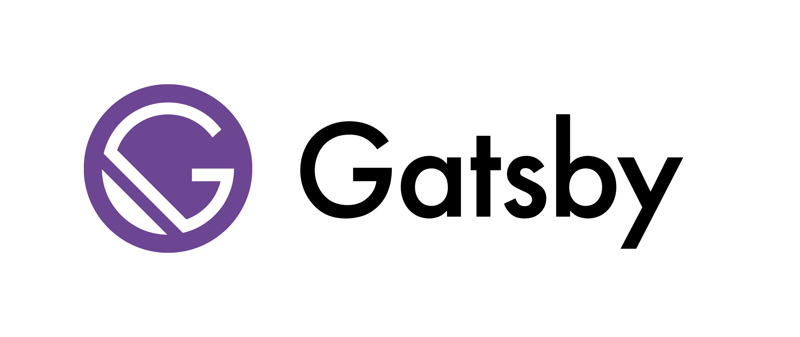

# Why to use Gatsby?  :tada:
Gatsby Features:

```
	- Support Markdown Files
	- Support Graphql queries
	- Support StyledComponents
	- Image lazyloading
	- Plugin for everything
	- Awesome community
	- and lots more.
```

# How to start a project

### 1. Install Gatsby

This command will install the gatsby cli on your system  :smile:
```
npm install -g gatsby-cli
```

### Create a project 

new is the command to create a new project, we are using the helloworld starter provided by gatsby to create a new project.
```
gatsby new hello-world https://github.com/gatsbyjs/gatsby-starter-hello-world
```

When creating a new Gatsby site, you can use the following command structure to create a new site based on any existing Gatsby starter:
```
gatsby new [SITE_DIRECTORY_NAME] [URL_OF_STARTER_GITHUB_REPO]
```

### Project Structure

You provide configuration to the Typography.js JS api and it uses its Typography engine to generate CSS for block and inline elements.

One of the things I love about React is how much JavaScript it is. If you can build a simple app with regular JavaScript and DOM APIs then you'll understand the benefits of React much better. You'll also be much more effective using React because honestly, 90% of being effective with React is understanding JavaScript well. For this, I suggest reading my blog post "JavaScript to Know for React". Also check out JavaScript30.com (totally free) and BeginnerJavaScript.com (not free) both by Wes Bos.


